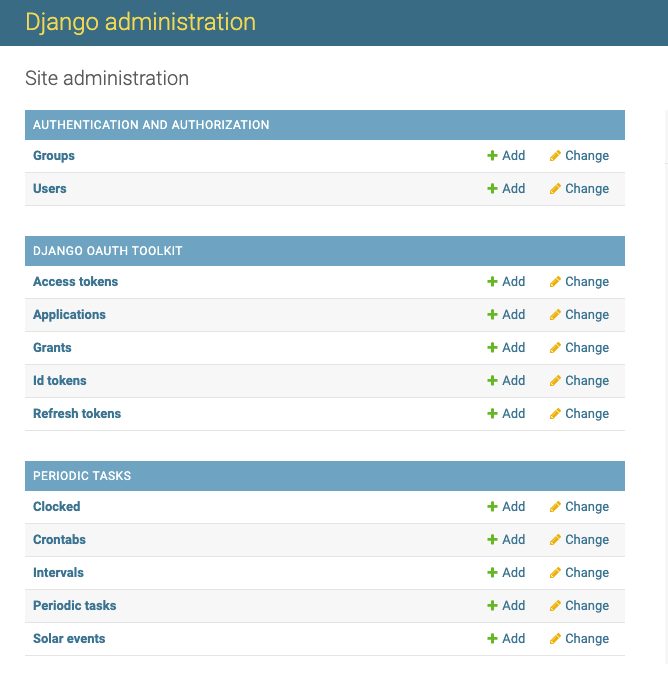
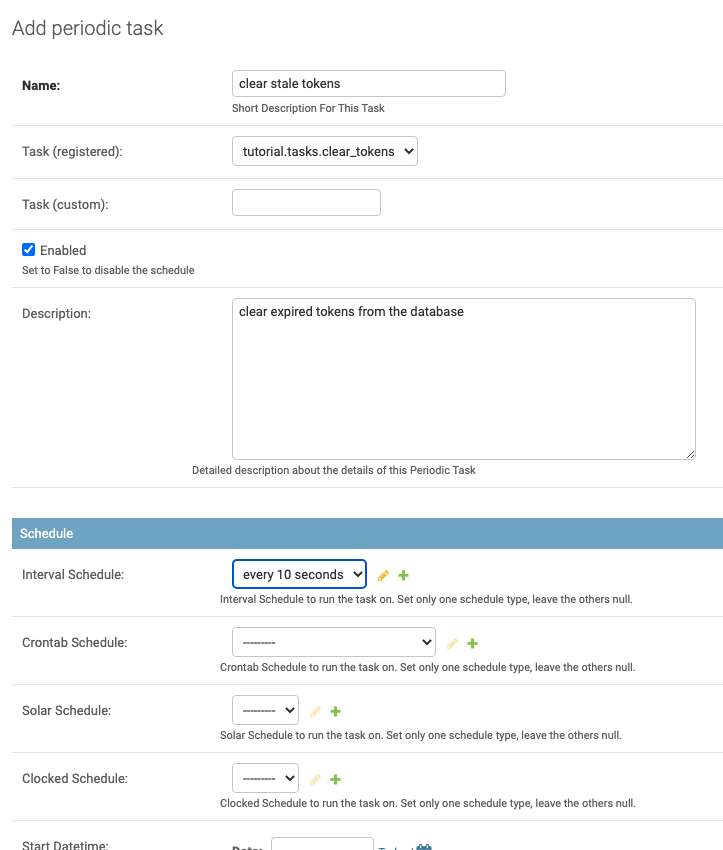

Part 5 - Using Celery to Automate Maintenance Chores
====================================================

Scenario
--------
In :doc:`Part 1 <tutorial_01>` you created your own :term:`Authorization Server` and it's running along just fine.
However, the database is getting cluttered with expired tokens. You can periodically run
the :doc:`cleartokens management command <../management_commands>`, but why not automate this with
`Celery <https://docs.celeryq.dev/>`_?

Set up RabbitMQ
---------------
Celery components communicate via a message queue. We'll use `RabbitMQ <https://www.rabbitmq.com/>`_.

Install RabbitMQ on MacOS
~~~~~~~~~~~~~~~~~~~~~~~~~~
If you are using MacOS it's likely you are already using `Homebrew <https://brew.sh/>`_. If not, now's
the time to install this fantastic package manager.

::

   brew install rabbitmq
   brew service start rabbitmq

Install RabbitMQ with Docker
~~~~~~~~~~~~~~~~~~~~~~~~~~~~
This will start up a docker image that just works:
::

   docker run -it --rm --name rabbitmq -p 5672:5672 -p 15672:15672 rabbitmq:3.9-management

Install RabbitMQ on Windows
~~~~~~~~~~~~~~~~~~~~~~~~~~~
See the `RabbitMQ Installing on Windows <https://www.rabbitmq.com/install-windows.html>`_ instructions.

Add Celery
----------
Make sure you virtualenv is active and install ``celery`` and
`django-celery-beat <https://django-celery-beat.readthedocs.io/>`_.

::

    pip install celery django-celery-beat

Update your list of installed apps to include both your :term:`Authorization Server` app -- we'll call it ``tutorial``,
and ``django_celery_beat`` which extends your Django project to store your periodic task schedule
in the database and adds a Django Admin interface for configuring them.

.. code-block:: python

    INSTALLED_APPS = {
        # ...
        "tutorial",
        "django_celery_beat",
    }

Now add a new file to your app to add Celery: :file:`tutorial/celery.py`:

.. code-block:: python

    import os

    from celery import Celery
    from django.conf import settings

    # Set the default Django settings module for the 'celery' program.
    os.environ.setdefault('DJANGO_SETTINGS_MODULE', 'tutorial.settings')
    app = Celery('tutorial', broker="pyamqp://guest@localhost//")
    app.config_from_object('django.conf:settings', namespace='CELERY')

    # Load task modules from all registered Django apps.
    app.autodiscover_tasks()

This will autodiscover any :file:`tasks.py` files in the list of installed apps.
We'll add ours now in :file:`tutorial/tasks.py`:

.. code-block:: python

    from celery import shared_task

    @shared_task
    def clear_tokens():
        from oauth2_provider.models import clear_expired

        clear_expired()

Finally, update :file:`tutorial/__init__.py` to make sure Celery gets loaded when the app starts up:

.. code-block:: python

    from .celery import app as celery_app

    __all__ = ('celery_app',)

Run Celery Beat and the Worker
------------------------------

RabbitMQ should already be running; it's the "glue" between Beat and the Worker.

It's best to run each of these in its own terminal window so you can see the log messages.

Start Celery Beat
~~~~~~~~~~~~~~~~~

::

    celery -A tutorial beat -l INFO  --scheduler django_celery_beat.schedulers:DatabaseScheduler

Start Celery Worker
~~~~~~~~~~~~~~~~~~~

::

    celery -A tutorial worker -l INFO

Configure the ``clear_tokens`` task
-----------------------------------

Go into `Django Admin <http://127.0.0.1:8000/admin/>`_ and you'll see a new section for periodic tasks:

Now let's define a fairly short (10 second) interval. Go to: http://127.0.0.1:8000/admin/django_celery_beat/intervalschedule/
and select Add Interval, set number of intervals to 10 and interval period to seconds and Save.

Then go to http://127.0.0.1:8000/admin/django_celery_beat/periodictask/ to add a new periodic task by
selecting `Add Periodic Task <http://127.0.0.1:8000/admin/django_celery_beat/periodictask/add/>`_ and
select ``tutorial.tasks.clear_tokens``, choose the ``every 10 seconds`` interval schedule, and "Save."

Now your Celery Beat and Celery Workers should start running the task every 10 seconds.

The Beat console will look like this:

::

   [2022-03-19 22:06:35,605: INFO/MainProcess] Scheduler: Sending due task clear stale tokens (tutorial.tasks.clear_tokens)

And the Workers console like this:

::

   [2022-03-19 22:06:35,614: INFO/MainProcess] Task tutorial.tasks.clear_tokens[5ec25fb8-5ce3-4d15-b9ad-750b80fc07e0] received
   [2022-03-19 22:06:35,616: INFO/ForkPoolWorker-8] refresh_expire_at is None. No refresh tokens deleted.
   [2022-03-19 22:06:35,629: INFO/ForkPoolWorker-8] 0 Expired access tokens deleted
   [2022-03-19 22:06:35,631: INFO/ForkPoolWorker-8] 0 Expired grant tokens deleted
   [2022-03-19 22:06:35,632: INFO/ForkPoolWorker-8] Task tutorial.tasks.clear_tokens[5ec25fb8-5ce3-4d15-b9ad-750b80fc07e0] succeeded in 0.016124433999999965s: None

References
----------

The preceding is based on these references:

* https://docs.celeryq.dev/en/stable/django/first-steps-with-django.html
* https://docs.celeryq.dev/en/stable/userguide/periodic-tasks.html#beat-custom-schedulers
* https://django-celery-beat.readthedocs.io/en/latest/index.html
