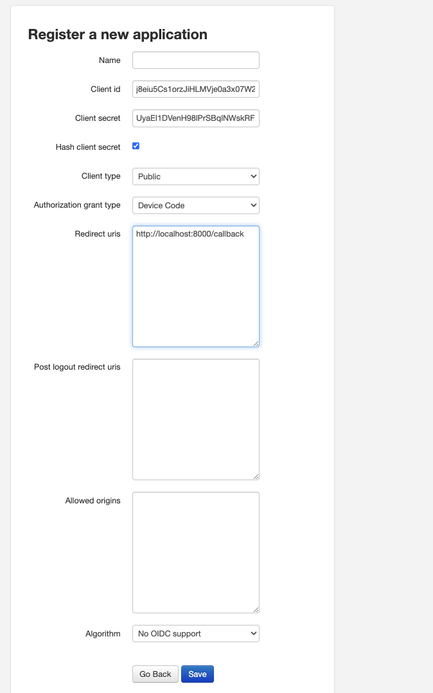
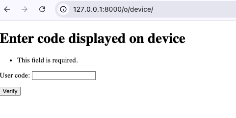
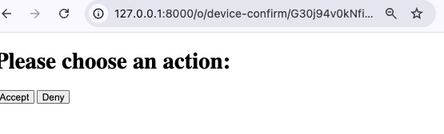

Part 6 - Device authorization grant flow
====================================================

Scenario
--------
In :doc:`Part 1 <tutorial_01>` you created your own :term:`Authorization Server` and it's running along just fine.
You have devices that your users have, and those users need to authenticate the device against your
:term:`Authorization Server` in order to make the required API calls.

Device Authorization
--------------------
The OAuth 2.0 device authorization grant is designed for Internet
connected devices that either lack a browser to perform a user-agent
based authorization or are input-constrained to the extent that
requiring the user to input text in order to authenticate during the
authorization flow is impractical. It enables OAuth clients on such
devices (like smart TVs, media consoles, digital picture frames, and
printers) to obtain user authorization to access protected resources
by using a user agent on a separate device.

Point your browser to `http://127.0.0.1:8000/o/applications/register/` to create an application.

Fill the form as shown in the screenshot below, and before saving, take note of the ``Client id``.
Make sure the client type is set to "Public." There are cases where a confidential client makes sense,
but generally, it is assumed the device is unable to safely store the client secret.

Ensure the setting ``OAUTH_DEVICE_VERIFICATION_URI`` is set to a URI you want to return in the
`verification_uri` key in the response. This is what the device will display to the user.

1. Navigate to the tests/app/idp directory:

.. code-block:: sh

    cd tests/app/idp

then start the server

.. code-block:: sh

    python manage.py runserver

.. _RFC: https://www.rfc-editor.org/rfc/rfc8628
.. _RFC section 3.5: https://datatracker.ietf.org/doc/html/rfc8628#section-3.5

2. To initiate device authorization, send this request (in the real world, the device
makes this request). In `RFC`_ Figure 1, this is step (A).

.. code-block:: sh

    curl --location 'http://127.0.0.1:8000/o/device-authorization/' \
        --header 'Content-Type: application/x-www-form-urlencoded' \
        --data-urlencode 'client_id={your application client id}'

The OAuth2 provider will return the following response. In `RFC`_ Figure 1, this is step (B).

.. code-block:: json

    {
        "verification_uri": "http://127.0.0.1:8000/o/device",
        "expires_in": 1800,
        "user_code": "A32RVADM",
        "device_code": "G30j94v0kNfipD4KmGLTWeL4eZnKHm",
        "interval": 5
    }

In the real world, the device will somehow make the value of the `user_code` available to the user (either on-screen display,
or Bluetooth, NFC, etc.). In `RFC`_ Figure 1, this is step (C).

3. Go to `http://127.0.0.1:8000/o/device` in your browser.

Enter the code, and it will redirect you to the device-confirm endpoint. In `RFC`_ Figure 1, this is step (D).

Device-confirm endpoint
-----------------------
4. Device polling occurs concurrently while the user approves or denies the request.

Device polling
--------------
Send the following request (in the real world, the device makes this request). In `RFC`_ Figure 1, this is step (E).

.. code-block:: sh

    curl --location 'http://localhost:8000/o/token/' \
        --header 'Content-Type: application/x-www-form-urlencoded' \
        --data-urlencode 'device_code={the device code from the device-authorization response}' \
        --data-urlencode 'client_id={your application client id}' \
        --data-urlencode 'grant_type=urn:ietf:params:oauth:grant-type:device_code'

In `RFC`_ Figure 1, there are multiple options for step (F), as per `RFC section 3.5`_. Until the user enters the code
in the browser and approves, the response will be 400:

.. code-block:: json

    {"error": "authorization_pending"}

Or if the user has denied the device, the response is 400:

.. code-block:: json

    {"error": "access_denied"}

Or if the token has expired, the response is 400:

.. code-block:: json

    {"error": "expired_token"}

However, after the user approves, the response will be 200:

.. code-block:: json

    {
        "access_token": "SkJMgyL432P04nHDPyB63DEAM0nVxk",
        "expires_in": 36000,
        "token_type": "Bearer",
        "scope": "openid",
        "refresh_token": "Go6VumurDfFAeCeKrpCKPDtElV77id"
    }
